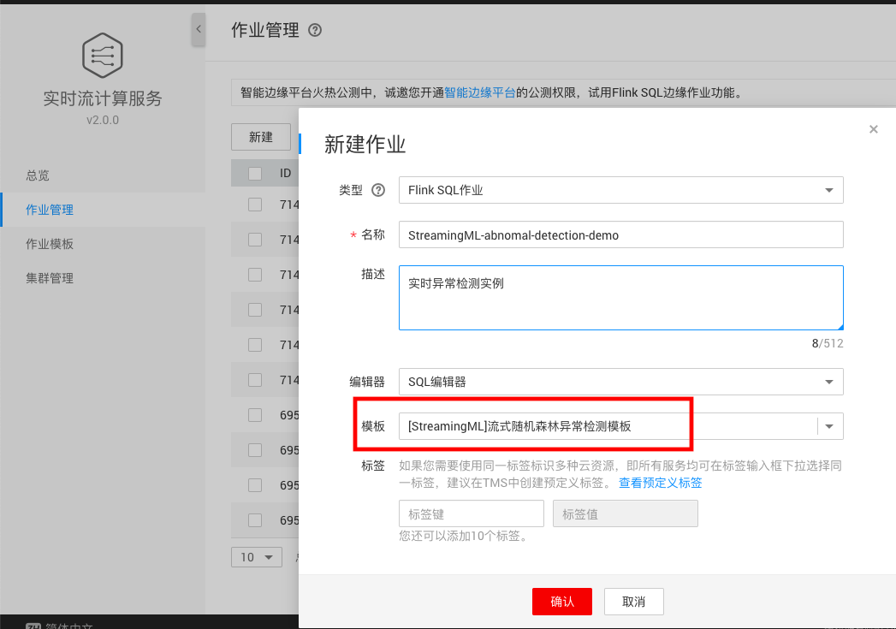
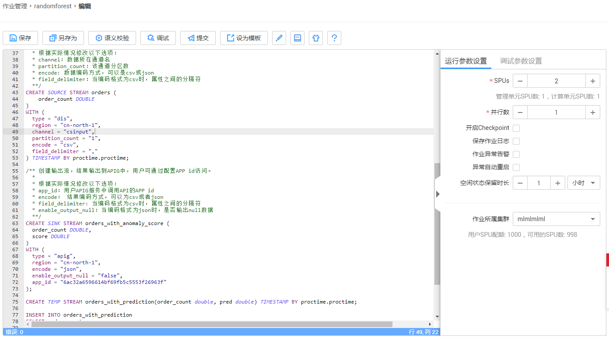
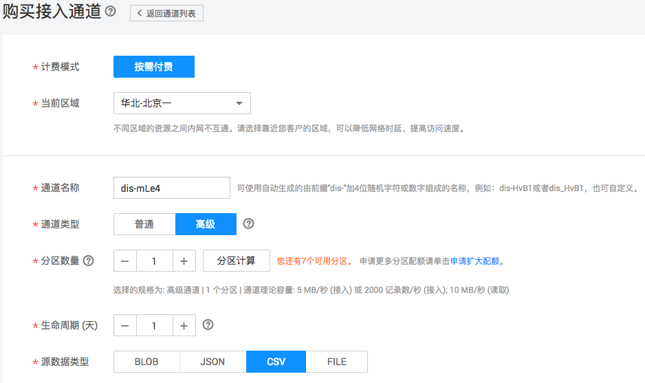
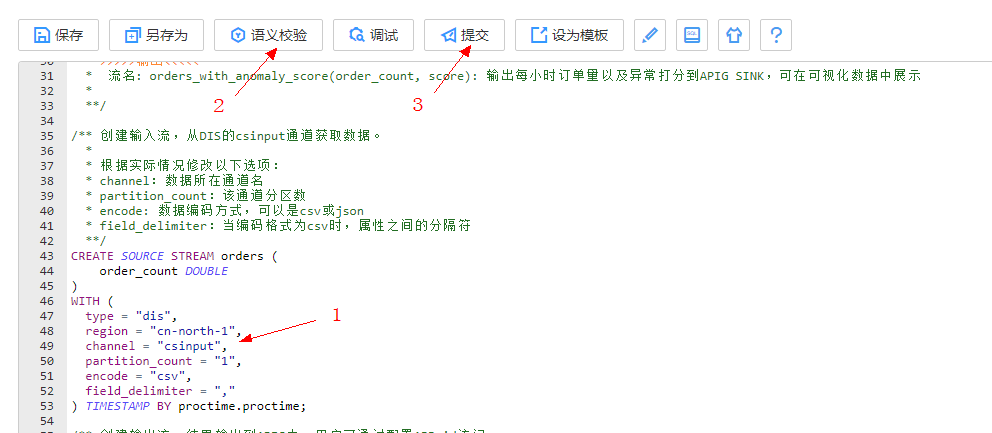
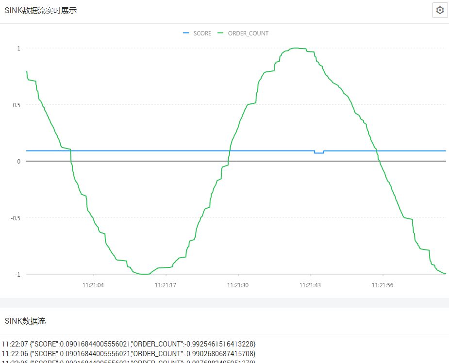

#  实时AI-StreamingML示例：实时异常检测

[TOC]

##  任务介绍

在本示例中，从DIS数据源读数据，使用StreamingML的Holt-Winters算法和流式随机森林算法，实时检测异常数据, 结果输出到可视化监控大盘。

任务采用的数据为正弦曲线，模拟电商订单成交量的周期性变化。同学可以在数据生成时混入异常数据，验证算法是否能识别出这些异常数据。

本示例中你会学习到：

- 创建并运行Flink SQL（Holt-Winters算法和流式随机森林算法）
- 完成“异常数据检测”
- 完成可视化展示

本示例的github地址：[huaweicloud-cs-examples](https://github.com/huaweicloud/huaweicloud-cs-sdk/tree/master/huaweicloud-cs-examples)

> 实时流计算服务（Cloud Stream Service, 简称CS）提供实时处理流式大数据的全栈能力, 简单易用, 即时执行Stream SQL或自定义作业。无需关心计算集群, 无需学习编程技能。完全兼容Apache Flink和Spark API。详见[这里](https://www.huaweicloud.com/product/cs.html)

##  任务执行

###  第一步：创建Flink SQL作业

####  1. 进入CS控制台
- 直接进入 [**CS控制台**](https://console.huaweicloud.com/cs/?region=cn-north-1#/overview)
- [华为云官网](http://www.huaweicloud.com) -> 产品 -> [EI企业智能](https://www.huaweicloud.com/ei/) -> [实时流计算服务](https://www.huaweicloud.com/product/cs.html)，进入实时流计算的首页后，点击`立即使用`


####  2. 新建Flink SQL作业
`作业管理 -> 新建`：选择模版 `[StreamingML]流式随机森林异常检测模板`


- 编辑器：Flink SQL作业支持**SQL编辑器**和**SQL可视化编辑器**，这里选择`SQL编辑器`
- 模版：目前提供了19个缺省模版，也支持用户自定义模版

点击“确认”，完成新建Flink SQL作业

####  3. SQL编辑器



**SQL编辑器中包含三部分内容：**

1. source数据源：在`with`语句中配置，这里选择的是DIS，就需要配置

   - type = "dis"     # 类型选择DIS
   - region = "cn-north-1"   # Region名称为当前所在的区域，名称见：[这里](https://developer.huaweicloud.com/endpoint?CS)
   - channel = "csinput"      # 在DIS中新建的通道名称，**如果csinput已经存在，则创建一个新的通道**，**[新建DIS通道见这里](https://console.huaweicloud.com/dis/?region=cn-north-1#/manage/instanceList)**
   - partition_count = "1",   # 在DIS中通道的分区数
   - encode = "csv",            #  数据格式，CSV
   - field_delimiter = ","       #  行数据风格符，默认逗号分隔

   ```sql
   /** 创建输入流，从DIS的csinput通道获取数据。
     *
     * 根据实际情况修改以下选项：
     * channel：数据所在通道名
     * partition_count：该通道分区数
     * encode: 数据编码方式，可以是csv或json
     * field_delimiter：当编码格式为csv时，属性之间的分隔符
     **/
   CREATE SOURCE STREAM orders (
       order_count DOUBLE
   )
   WITH (
     type = "dis",
     region = "cn-north-1",
     channel = "csinput",
     partition_count = "1",
     encode = "csv",
     field_delimiter = ","
   ) TIMESTAMP BY proctime.proctime;
   ```

2. sink输出流：实时流可视化-实时绘图

   - app_id: API 网关ID，进入: [API网关](https://console.huaweicloud.com/apig/?region=cn-north-1&locale=zh-cn#/apig/manager/useapi/applymanager) `->` 调用API `->` 应用管理，点击“创建应用”，`应用ID`拷贝过来作为`app_id`的value值
   - 其余字段默认即可

    ```sql
   /** 创建输出流，结果输出到APIG中，用户可通过配置APP id访问。
     *
     * 根据实际情况修改以下选项：
     * app_id：用户APIG服务中调用API的APP id
     * encode： 结果编码方式，可以为csv或者json
     * field_delimiter: 当编码格式为csv时，属性之间的分隔符
     * enable_output_null：当编码格式为json时，是否输出null数据
     **/
   CREATE SINK STREAM orders_with_anomaly_score (
     order_count DOUBLE,
     score DOUBLE
   )
   WITH (
     type = "apig",
     region = "cn-north-1",
     encode = "json",
     enable_output_null = "false",
     app_id = "your_app_id"
   );
    ```

3. 流式查询SQL如下：

   ```sql
   CREATE TEMP STREAM orders_with_prediction(order_count double, pred double) TIMESTAMP BY proctime.proctime;
   
   INSERT INTO orders_with_prediction
   SELECT order_count, 
   	CONSERVATIVE_HOLT_WINTERS(order_count, 360, 0.2) 
   		OVER (ORDER BY proctime ROWS BETWEEN 360 PRECEDING AND CURRENT ROW) AS pred, localtimestamp
   FROM orders;
   
   INSERT INTO orders_with_anomaly_score
   SELECT order_count,
   	SRF_UNSUP(ARRAY[POWER(ABS(order_count - pred), 2)]) 
   		OVER (ORDER BY proctime ROWS BETWEEN 360 PRECEDING AND CURRENT ROW) as score FROM orders_with_prediction;
   		
   ```

   由于非季节性的ARIMA模型和基于随机森林的异常检测都不能很好的处理具有季节性的数据，所以我们在此采用一种方法：首先使用Holt-Winters算法预测数据流未来的值，然后对于预测值和实际值的差值运行异常检测算法。

####  4. 运行参数设置

在SQL编辑器的右侧，设置如下参数：

- SPU：Stream Processing Units 流处理单元，一个SPU为1核4G的资源，每SPU 0.5元/小时。最低2个SPU起。必选
- 并行数：Flink作业算子并行度，缺省为1。必选
- 开启checkpoint：是否开启Flink快照。非必选
- 保存作业日志：作业日志是否保存，会保存到您个人的OBS桶中。非必选
- 开启作业异常告警：作业异常后可推送SMN消息（邮件和短线）。非必选

###  第二步：创建DIS通道

DIS数据摄入服务，其类似kafka的topic概念。

> 如果前面已经创建成功，则忽略这一步

####  1. 创建DIS通道

进入[DIS控制台](https://console.huaweicloud.com/dis/?region=cn-north-1#/manage/instanceList)，点击右侧`购买接入通道`，创建DIS通道：`csinput`。



源数据类型选为`CSV`

###  第三步：提交运行Flink SQL作业

进入：[CS控制台](https://console.huaweicloud.com/cs/?region=cn-north-1#/jobs/list) -> 作业管理  -> 选定已创建的作业，点击“编辑”

- 补充在`第二步`得到的DIS通道信息
- 点击“语义校验”检查SQL语句
- 点击“提交”



###  第四步：发送DIS数据，测试结果

至此，实时流计算方面的工作完成了，下面就要接入数据，查看实时计算结果。这里提供两种方法发送数据:

1. 第一种使用DIS Agent，详细步骤可参考前一天的教程。这里提供python脚本生成正弦曲线。

    ```python
    import time
    import math
    
    for idx in range(100000):
      with open("sin.txt", mode="a+") as f:
          f.write(str(math.sin(math.radians(idx)))+"\n")
      time.sleep(0.1)
    ```

    为了使DIS Agent能够及时检测到文件的变化，需要修改Dis Agent中conf/agent.yml文件中的配置项：` maxBufferAgeMillis: 1000`

2. 第二种为创建Maven工程

   ####  创建Maven工程

   这里使用DIS的java包来为DIS发送数据，在Eclipse或Idea中创建maven工程，并加入DIS和Log4j的依赖：

   ```xml
   <dependencies>
       <dependency>
           <groupId>com.huaweicloud.dis</groupId>
           <artifactId>huaweicloud-sdk-java-dis</artifactId>
           <version>1.3.0</version>
       </dependency>
   
       <!-- log4j2 -->
       <dependency>
           <groupId>org.apache.logging.log4j</groupId>
           <artifactId>log4j-api</artifactId>
           <version>2.8.2</version>
       </dependency>
       <dependency>
           <groupId>org.apache.logging.log4j</groupId>
           <artifactId>log4j-core</artifactId>
           <version>2.8.2</version>
       </dependency>
       <dependency>
           <groupId>org.apache.logging.log4j</groupId>
           <artifactId>log4j-slf4j-impl</artifactId>
           <version>2.8.2</version>
       </dependency>
   </dependencies>
   ```

   ####  发送DIS数据

   在Maven工程中添加如下Java文件，并完成代码片段编写：

   1. 填入认证信息：AK/SK, projectID, 通道名称
   2. 模拟周期性数据发送
   3. 运行代码

   ```java
   import com.huaweicloud.dis.DIS;
   import com.huaweicloud.dis.DISClientBuilder;
   import com.huaweicloud.dis.core.util.StringUtils;
   import com.huaweicloud.dis.exception.DISClientException;
   import com.huaweicloud.dis.iface.data.request.PutRecordsRequest;
   import com.huaweicloud.dis.iface.data.request.PutRecordsRequestEntry;
   import com.huaweicloud.dis.iface.data.response.PutRecordsResult;
   import com.huaweicloud.dis.iface.data.response.PutRecordsResultEntry;
   import org.slf4j.Logger;
   import org.slf4j.LoggerFactory;
   
   import java.nio.ByteBuffer;
   import java.util.ArrayList;
   import java.util.List;
   import java.util.concurrent.ThreadLocalRandom;
   
   public class SRFProducer {
     private static final Logger LOGGER = LoggerFactory.getLogger(SRFProducer.class);
   
     public static void main(String args[]) {
       runProduceDemo();
     }
   
     private static void runProduceDemo() {
       // TODO: 创建DIS客户端实例
       DIS client = DISClientBuilder.standard()
           .withEndpoint("https://dis.cn-north-1.myhuaweicloud.com:20004")
           .withAk("your_ak")
           .withSk("your_sk")
           .withProjectId("your_project_id")
           .withRegion("cn-north-1")
           .build();
       String streamName = "csinput";
   
       // TODO: 模拟周期性数据发送， 可添加异常数据监测算法有效性。如下为发送周期性正弦函数样例
       int x = 0;
       while (true) {
         try {
           String msg = Double.toString(Math.sin(Math.toRadians(x)));
           sendMessage(client, streamName, msg);
           x++;
           Thread.sleep(100);
         } catch (InterruptedException e) {}
       }
     }
   
     /**
      * @param disClient  DIS客户端实例
      * @param streamName 流名称
      * @param message    上传的数据
      */
     private static void sendMessage(DIS disClient, String streamName, String message) {
       PutRecordsRequest putRecordsRequest = new PutRecordsRequest();
       putRecordsRequest.setStreamName(streamName);
       List<PutRecordsRequestEntry> putRecordsRequestEntryList = new ArrayList<PutRecordsRequestEntry>();
       ByteBuffer buffer = ByteBuffer.wrap(message.getBytes());
       PutRecordsRequestEntry entry = new PutRecordsRequestEntry();
       entry.setData(buffer);
       entry.setPartitionKey(String.valueOf(ThreadLocalRandom.current().nextInt(1000000)));
       putRecordsRequestEntryList.add(entry);
       putRecordsRequest.setRecords(putRecordsRequestEntryList);
   
       LOGGER.info("========== BEGIN PUT ============");
   
       PutRecordsResult putRecordsResult = null;
       try {
         putRecordsResult = disClient.putRecords(putRecordsRequest);
       } catch (DISClientException e) {
         LOGGER.error("Failed to get a normal response, please check params and retry. Error message [{}]",
             e.getMessage(),
             e);
       } catch (Exception e) {
         LOGGER.error(e.getMessage(), e);
       }
   
       if (putRecordsResult != null) {
         LOGGER.info("Put {} records[{} successful / {} failed].",
             putRecordsResult.getRecords().size(),
             putRecordsResult.getRecords().size() - putRecordsResult.getFailedRecordCount().get(),
             putRecordsResult.getFailedRecordCount());
   
         for (int j = 0; j < putRecordsResult.getRecords().size(); j++) {
           PutRecordsResultEntry putRecordsRequestEntry = putRecordsResult.getRecords().get(j);
           if (!StringUtils.isNullOrEmpty(putRecordsRequestEntry.getErrorCode())) {
             // 上传失败
             LOGGER.error("[{}] put failed, errorCode [{}], errorMessage [{}]",
                 new String(putRecordsRequestEntryList.get(j).getData().array()),
                 putRecordsRequestEntry.getErrorCode(),
                 putRecordsRequestEntry.getErrorMessage());
           } else {
             // 上传成功
             LOGGER.info("[{}] put success, partitionId [{}], partitionKey [{}], sequenceNumber [{}]",
                 new String(putRecordsRequestEntryList.get(j).getData().array()),
                 putRecordsRequestEntry.getPartitionId(),
                 putRecordsRequestEntryList.get(j).getPartitionKey(),
                 putRecordsRequestEntry.getSequenceNumber());
           }
         }
       }
       LOGGER.info("========== END PUT ============");
     }
   
   }
   
   ```

####  查看结果


点击SInk可视化查看实时数据，算法在稳定运行一段时间后可见Score分值稳定在较低水平（Score分值为0-1,分值越高，异常行为越剧烈）。

##  任务打卡

**截图：运行时数据流实时展示**



------------EOF--------------